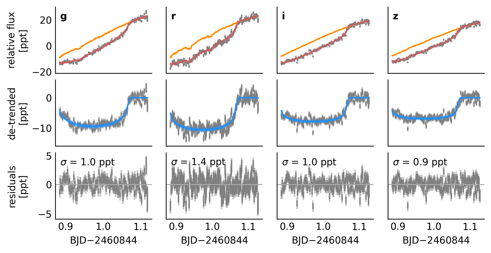
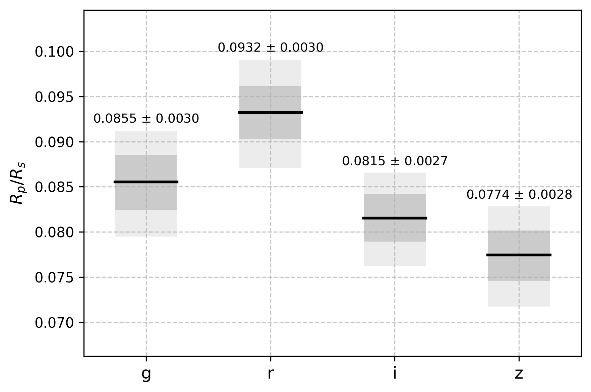
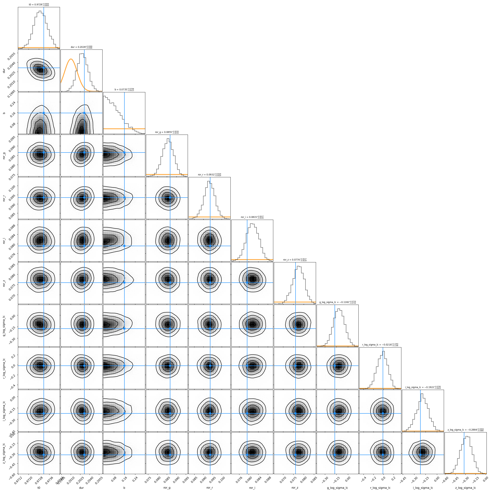
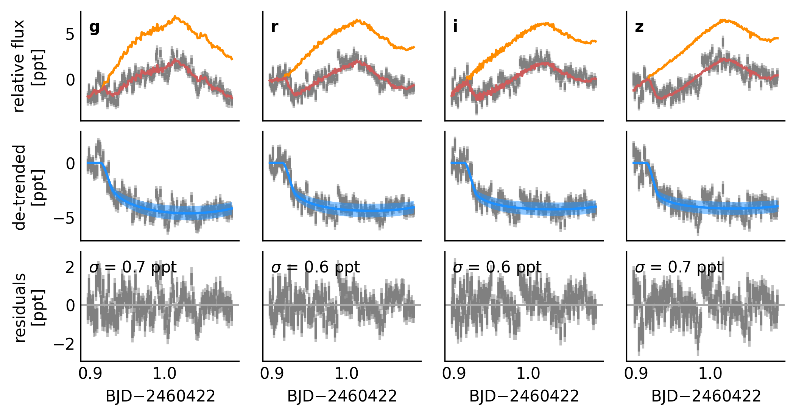
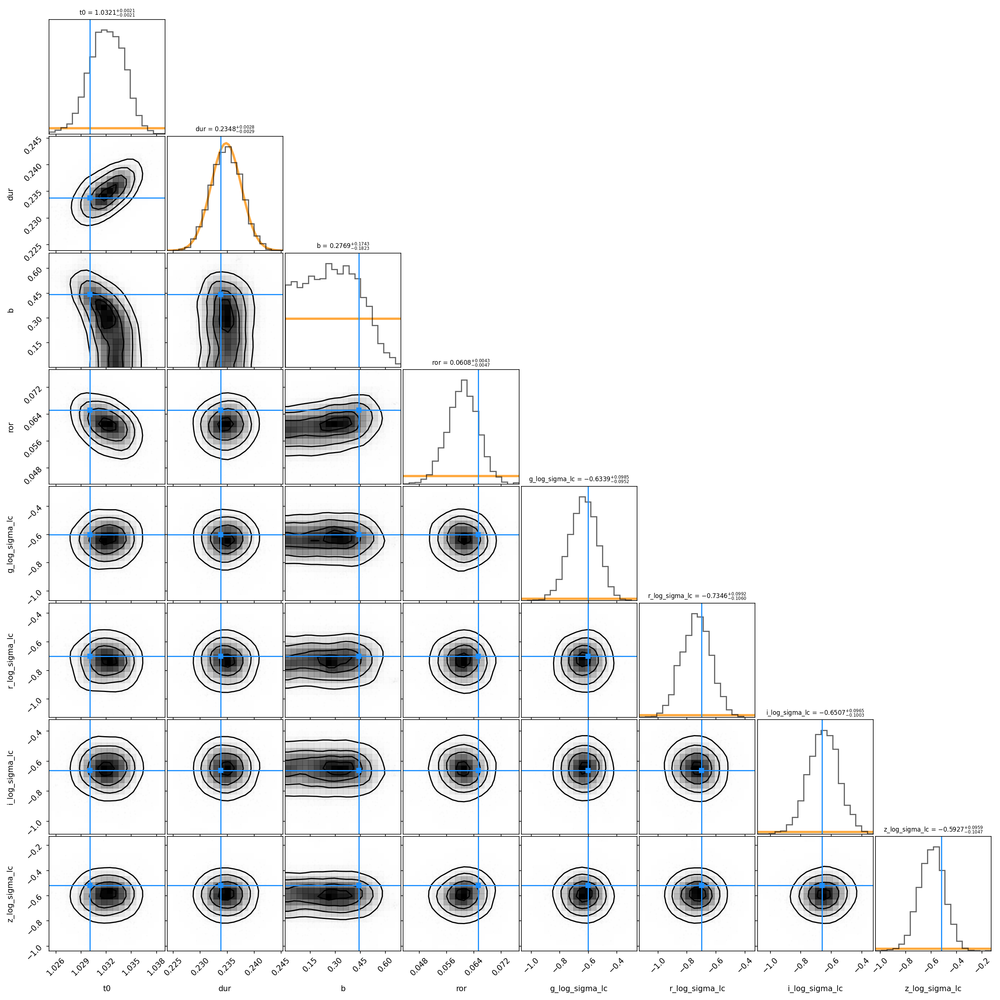
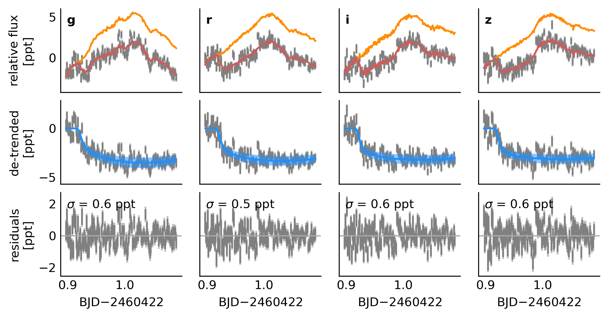
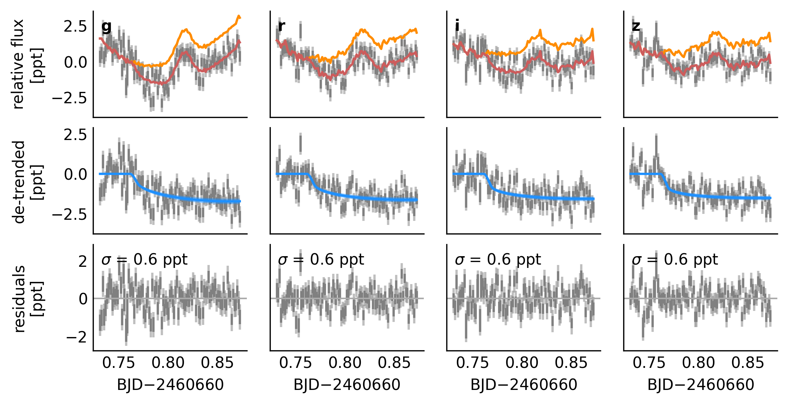
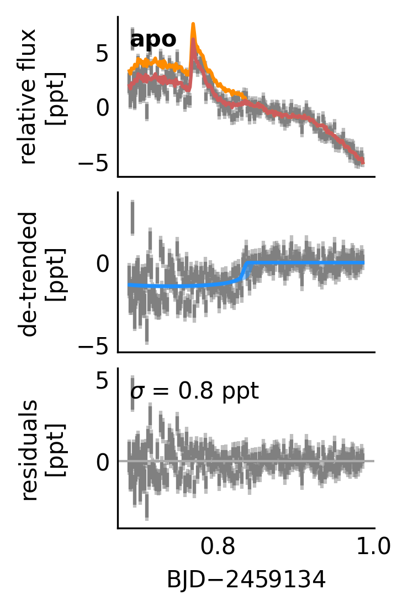
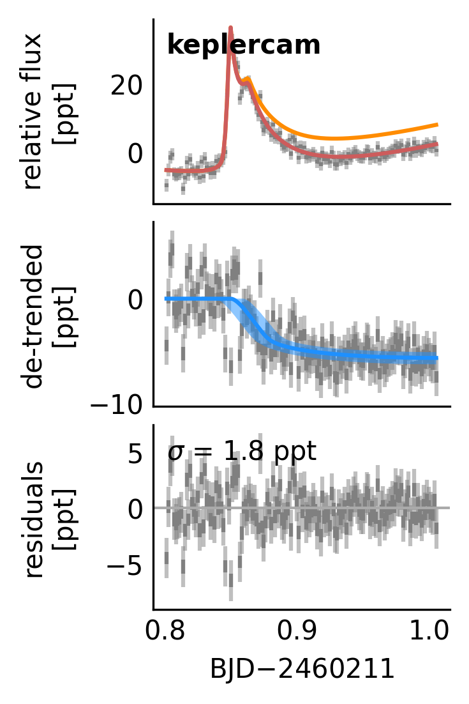

# Examples

All examples can be run from the repository root with `timex examples/<name>`.

## HIP 67522 b — chromatic transit

Multi-band (griz) transit of HIP 67522 b with MuSCAT4. Demonstrates simultaneous fitting with `chromatic: true` to measure per-band radius ratios.

```yaml
# fit.yaml
data:
  g:
    file: HIP67522b_250618_muscat4_g_narrow_c234568_r20.csv
    band: g
    trend: 1
    binsize: 0.00139
    format: afphot
  r:
    file: HIP67522b_250618_muscat4_Na_D_c2346_r18.csv
    band: r
    trend: 1
    binsize: 0.00139
    format: afphot
  i:
    file: HIP67522b_250618_muscat4_i_narrow_c234568_r20.csv
    band: i
    trend: 1
    binsize: 0.00139
    format: afphot
  z:
    file: HIP67522b_250618_muscat4_z_narrow_c23456_r20.csv
    band: z
    trend: 1
    binsize: 0.00139
    format: afphot
planets: b
tc_pred: 2460844.98
tc_pred_unc: 0.04
chromatic: true
uniform:
  ror: [0.01, 0.15]
  b: [0, 1]
fixed:
  - period
  - u_star
```







## HIP 67522 c — spline detrending

Multi-band transit of HIP 67522 c with spline detrending (`spline: true`) instead of polynomial trends.

```yaml
# fit.yaml
data:
  g:
    file: HIP67522_240422_muscat4_g_c234_r26.csv
    band: g
    spline: true
    binsize: 0.00139
    format: afphot
  r:
    file: HIP67522_240422_muscat4_r_c234_r26.csv
    band: r
    spline: true
    binsize: 0.00139
    format: afphot
  i:
    file: HIP67522_240422_muscat4_i_c234_r24.csv
    band: i
    spline: true
    binsize: 0.00139
    format: afphot
  z:
    file: HIP67522_240422_muscat4_z_c234_r22.csv
    band: z
    spline: true
    binsize: 0.00139
    format: afphot
planets: c
tc_pred: 2460423.03
tc_pred_unc: 0.1
chromatic: false
uniform:
  ror: [0.01, 0.15]
  b: [0, 1]
fixed:
  - period
  - u_star
```





### GP alternative

The same dataset can be fit using a Gaussian process (Matern-3/2) instead of splines for detrending. Replace `spline: true` with `trend: 1` for each dataset and add a `gp` section. Here `per_dataset: [log_amp]` fits a separate GP amplitude per band while sharing the length scale.

```yaml
# fit.yaml (changes from spline version)
data:
  g:
    trend: 1    # linear trend instead of spline
    # spline: true  (remove or set false)
  # ... same for r, i, z
use_gp: true
gp:
  log_amp: -1
  log_amp_unc: 4
  log_amp_prior: uniform
  log_scale: -1
  log_scale_unc: 4
  log_scale_prior: uniform
  per_dataset: [log_amp]
n_restarts: 5
```

The transit timing measurement from the GP fit is within ~0.3-sigma of the spline fit.



## V1298 Tau c — spot crossing

Transit of V1298 Tau c with a spot-crossing event modeled as a Gaussian bump (`include_bump: true`). With `chromatic_bump: true`, the bump amplitude is fit independently per band.

```yaml
# fit.yaml
data:
  g:
    file: V1298Tauc_241215_muscat3_g_c245678_r18_mapping.csv
    band: g
    trend: 1
    binsize: 0.00139
    format: afphot
  r:
    file: V1298Tauc_241215_muscat3_r_c245678_r20_mapping.csv
    band: r
    trend: 1
    binsize: 0.00139
    format: afphot
  i:
    file: V1298Tauc_241215_muscat3_i_c245678_r24_mapping.csv
    band: i
    trend: 1
    binsize: 0.00139
    format: afphot
  z:
    file: V1298Tauc_241215_muscat3_z_c245678_r28_mapping.csv
    band: z
    trend: 1
    binsize: 0.00139
    format: afphot
planets: c
tc_pred_iso: 2024-12-16 8:57
tc_pred_unc: 0.04
fixed:
  - period
  - u_star
chromatic: false
include_bump: true
chromatic_bump: true
bump:
  ampl: 1.5
  ampl_unc: 3
  ampl_prior: uniform
  tcenter: 2460660.81
  tcenter_unc: 0.02
  tcenter_prior: uniform
  width: 0.01
  width_unc: 0.02
  width_prior: uniform
```



## V1298 Tau c — flare (shared parameters)

Transit of V1298 Tau c with two overlapping flares modeled simultaneously. Scalar parameters (`ampl`, `fwhm`, etc.) are shared across both flares while `tpeak` is specified per-flare.

```yaml
# fit.yaml
data:
  apo:
    file: arctic_apo_flare_v1298tau+aux.txt
    band: z
    trend: 1
    binsize: 0.00139
planets: c
tc_pred: 2459134.74
tc_pred_unc: 0.06
fixed:
  - period
  - u_star
include_flare: true
flare:
  ampl: 5
  ampl_unc: 10
  ampl_prior: uniform
  tpeak: [2459134.77, 2459134.78]
  tpeak_unc: 0.02
  tpeak_prior: uniform
  fwhm: 0.02
  fwhm_unc: 0.04
  fwhm_prior: uniform
```

{ width="33%" }

## V1298 Tau e — flare (per-flare parameters)

Transit of V1298 Tau e with two flares where all parameters are specified independently per flare. Any subset of `tpeak`, `tpeak_unc`, `fwhm`, `fwhm_unc`, `ampl`, `ampl_unc` can be a list (must match number of flares) or a scalar (broadcast to all flares).

```yaml
# fit.yaml
data:
  keplercam:
    file: V1298Tau-e_20230924_KeplerCam_zp.txt
    band: z
    trend: 1
    binsize: 0.00139
    trim_end: 0.01
planets: e
tc_pred_iso: 2023-09-24 12:26
tc_pred_unc: 0.08
fixed:
  - period
  - u_star
include_flare: true
flare:
  ampl: [40, 15]
  ampl_unc: [80, 30]
  ampl_prior: uniform
  tpeak: [2460211.8493, 2460211.863]
  tpeak_unc: [0.001, 0.005]
  tpeak_prior: uniform
  fwhm: [0.01, 0.03]
  fwhm_unc: [0.02, 0.06]
  fwhm_prior: uniform
```

{ width="33%" }
